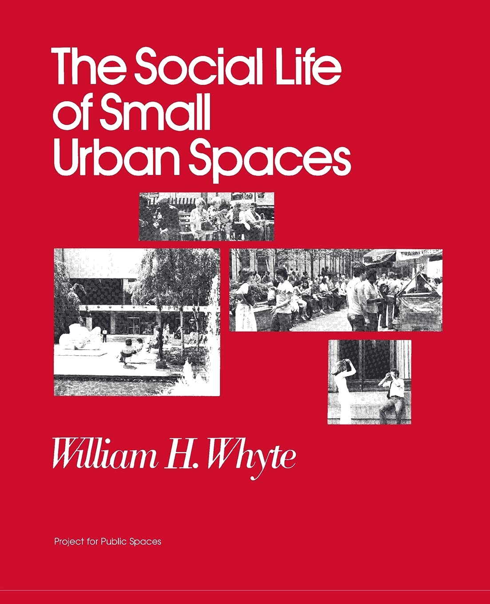
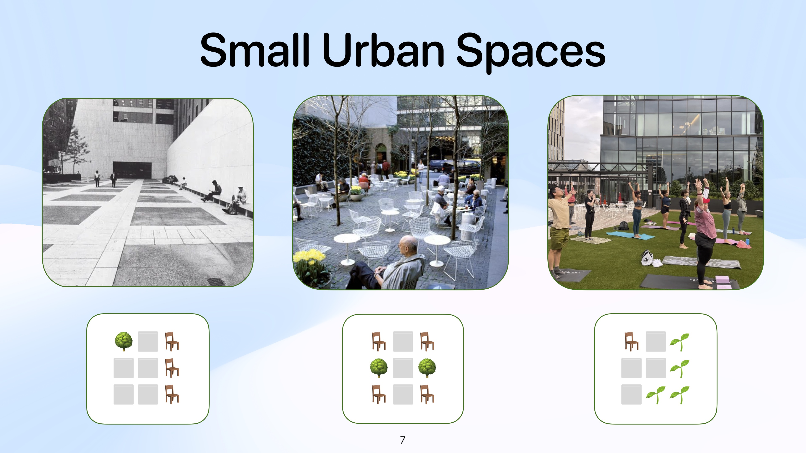
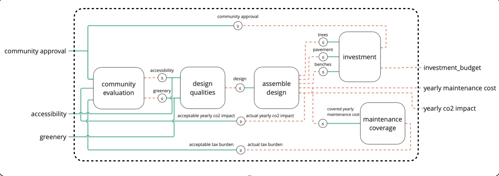
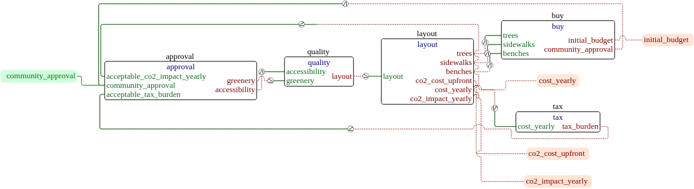
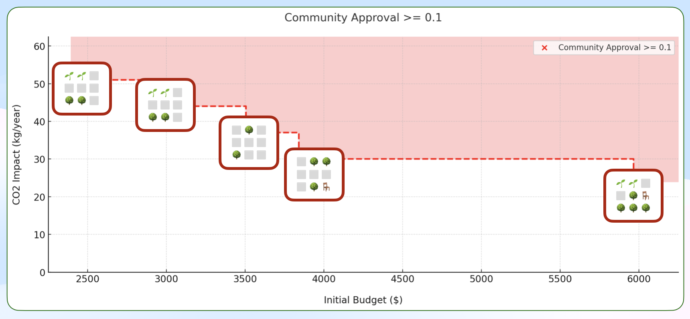
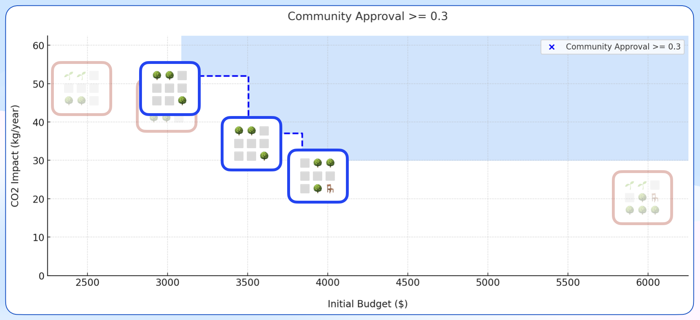
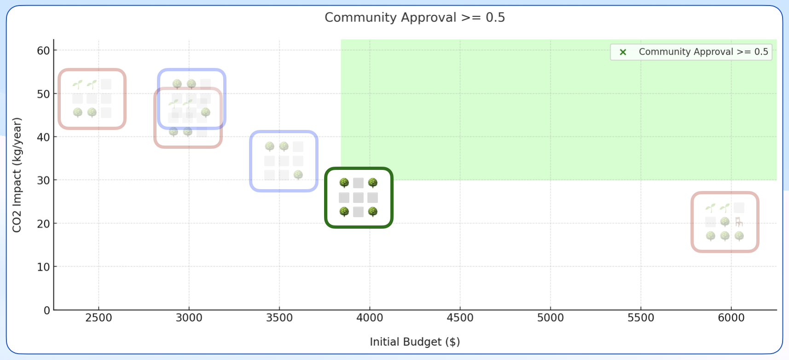
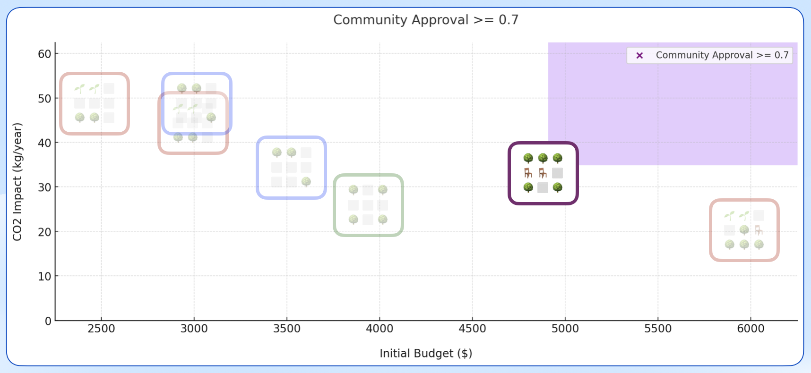
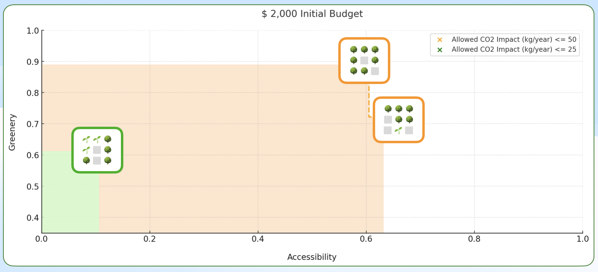
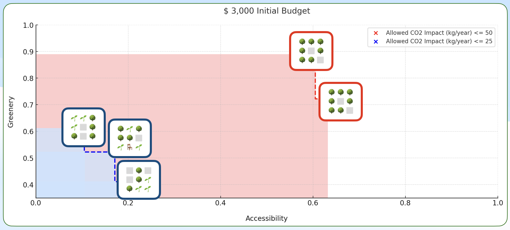

1.S980: Applied Category Theory for Engineering Design, Gioele Zardini

Deniz Aydemir

# Summary

## Motivation
The goal of this project is to show how co-design may be used for urban and policy design. Complex urban and socio-political systems are rich with feedback loops (e.g. community feedback, induced demand) and are highly interconnected, a great match for co-design. William Whyte's seminal book is an inspiration for this small case study.

<div align="center">

</div>


## Co-design for Small Urban Spaces

The design problem in this project builds and evaluates small 3x3 grids that represent an urban space. Each tile in the grid is either made of grass, trees, pavement, or benches. While a simplified example, we see the co-design framework produces reasonable results from a pool of 400 design layouts: prioritizing accessibility at lower budgets and providing lush greenery at higher budgets. See [Implementation](#implementation) for more details.

## Further Study
Co-design and System Dynamics seem to provide similar capabilities and intuitive power. There is likely a way to connect the two paradigms formally using category theory.

Believing there are better or worse outcomes implies certain partial orders, the interfaces in co-design problems. How can these moral values be equitably surfaced and solicited when designing complex systems?

Small urban spaces are only small urban pieces of a greater city system. The compositional nature of co-design presents an opportunity to use many different representative design problems to build out a composable, category-theoretic image of the city.

# Implementation

## Small Urban Spaces



The overall design problem builds and evaluates small 3x3 grids that represent an urban space. Each tile in the grid is either made of grass, trees, pavement, or benches. The grid generation, poset generation, and design problem catalog generation all can be found in [designer.ipynb](designer.ipynb).

## Design Problem



### Decomposition
The overall design problem considered for this project contains the following functionalities: community approval, greenness, and accessibility. The requirements of the overall design problem are an initial investment budget, a yearly maintenance cost, and a net yearly co2 impact. The overall design problem was broken down into the following sub-problems:
- Investment: provides raw materials for an initial budget
- Assembly: provides spatial designs for a set of raw materials
- Maintenance: provides acceptable maintenance costs for a community approval level
- Qualities: provides the positive qualities (accessibility, greenness) for a spatial design
- Evaluation: provides a community approval for a positive quality value

### Feedback
An especially powerful capability of co-design is its ability to handle feedback loops, of which there were three in this design problem:
- Community approval feedback: given the community approval determined in the engagement design problem, we may adjust our investment budget above our initial budget.
- Yearly CO2 impact feedback: given the acceptable level of co2 emission determined in the engagement design problem, we may have more affordance for co2 impact when choosing a design.
- Tax burden feedback: given the willingness to pay taxes for a certain design determined in the engagement design problem, we may be able to adjust our maintenance budget.

Here is the final mcdp-plot output:



## Results

After filtering out symmetrically equivalent 3x3 grid designs, there were 67,056 unique designs for small urban spaces. This number is far too many to run reasonable time mcdp queries without further improvements to the poset structure of the designs. As is, the designs exist in an unordered set ([urban_space.mcdplib/_posets/layout.mcdp_poset](urban_space.mcdplib/_posets/layout.mcdp_poset)), and thus monotonicity is not being leveraged as much as it could be during the queries. I made an attempt to use the budget cost to create an order for the designs, but I was not able to see an obvious improvement to the query times-- this might have been due to some issue on my end.

To manage this issue, a reduced set of designs were used as the pool of implementation options for the design problem. This was done by separating the designs into two subsets: designs with pavement access both east-west and north-south, and the rest. Then 200 designs were selected randomly from each subset, making a pool of 400 designs.

### Rsults for Fix Functionality Minimize Resources (FixFunMinRes):
For each query I changed the values in `urban_space_res` and ran
```bash
mcdp-solve-query --optimistic 80 --pessimistic 80 urban_space_res --imp
```





While there are significant simplifications and assumptions being made, we can see a coherent set of outcomes being produced. As the minimum community approval increases, we see certain designs no longer make the cut, and the pareto front always moves to a upper set.

An interesting takeaway: it seems like designs with through-cutting paths provide the "easiest" way to provide community approval, but in our final result we see that the cheapest way (in terms of both co2 impact and initial budget) to achieve a community approval >= 0.7 the design becomes much more green and we lose the through-cutting paths.

This of course depends on the specific logic used in the design problems, but it is an unexpected emergent phenomenon nonetheless.

### Results for Fix Resources Maximize Functionality (FixResMaxFun):
For each query I changed the values in `urban_space_fun` and ran
```bash
mcdp-solve-query --optimistic 80 --pessimistic 80 urban_space_fun --imp
```



More detailed outputs from the mcdp-solve-query runs (and the results of many trial runs) can be found in the [out-query](out-query/) folder.

# Materials

[Slides for the Composable Life of Small Urban Spaces Presentation](assets/urban-codesign.pdf)

# Acknowledgments
Thank you to Gioele Zardini and Yujun Huang for their guidance, help, and patience. Thank you to Xinling Li and Riccardo Fiorista for publishing [their co-design case study on bus route design](https://github.com/mit-zardini-lab/act4brd), it was very helpful for my thinking and debugging. Thanks to Michael Leong for spurring some of the thoughts regarding the potential composable co-design structure of the city.

